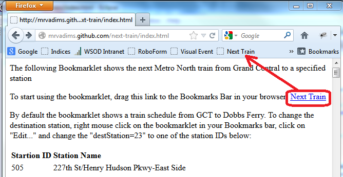

<html>
<body>
The following Bookmarklet shows the next Metro North train from Grand Central to a specified station  

To start using the bookmarklet, drag this link to the Bookmarks Bar in your browser: <a href="javascript:(function(){var script=document.createElement('SCRIPT');var destStation=23;script.onload=function(){if(typeof nextTrain=='function')nextTrain(destStation);};script.setAttribute('language','JavaScript');script.src='http://mrvadims.github.com/next-train/next-train.js';document.body.appendChild(script);})()">Next Train</a>

By default the bookmarklet shows a train schedule from GCT to Dobbs Ferry.  To change the destination station, right mouse click on the bookmarklet in your Bookmarks bar, click on "Edit..." and change the "destStation=23" to one of the station IDs below:

<table>
<tr><td><b>Startion ID</b></td><td><b>Station Name</b></td></tr>
<tr><td>505</td><td>227th St/Henry Hudson Pkwy-East Side</td></tr>
<tr><td>512</td><td>230th St/Riverdale Ave</td></tr>
<tr><td>506</td><td>232nd St/Henry Hudson Pkwy</td></tr>
<tr><td>507</td><td>235th St/Henry Hudson Pkwy-East Side</td></tr>
<tr><td>508</td><td>236th St/Henry Hudson Pkwy</td></tr>
<tr><td>514</td><td>236th St/Riverdale Ave</td></tr>
<tr><td>516</td><td>239th St/Henry Hudson Pkwy</td></tr>
<tr><td>510</td><td>239th St/Independence Ave.</td></tr>
<tr><td>518</td><td>246th St/Henry Hudson Pkwy</td></tr>
<tr><td>602</td><td>254th St/Riverdale Ave</td></tr>
<tr><td>604</td><td>256th St/Riverdale Ave</td></tr>
<tr><td>606</td><td>259th St/Arlington Ave</td></tr>
<tr><td>608</td><td>259th St/Riverdale Ave</td></tr>
<tr><td>614</td><td>260th St/Broadway</td></tr>
<tr><td>618</td><td>261st St/Riverdale Ave</td></tr>
<tr><td>616</td><td>262nd St/Broadway</td></tr>
<tr><td>620</td><td>263rd St/Riverdale Ave</td></tr>
<tr><td>168</td><td>Ansonia</td></tr>
<tr><td>99</td><td>Appalachian Trail</td></tr>
<tr><td>24</td><td>Ardsley-on-Hudson</td></tr>
<tr><td>46</td><td>Beacon</td></tr>
<tr><td>170</td><td>Beacon Falls</td></tr>
<tr><td>85</td><td>Bedford Hills</td></tr>
<tr><td>164</td><td>Bethel</td></tr>
<tr><td>57</td><td>Botanical Garden</td></tr>
<tr><td>162</td><td>Branchville</td></tr>
<tr><td>40702</td><td>Branford (SLE)</td></tr>
<tr><td>44</td><td>Breakneck Ridge</td></tr>
<tr><td>91</td><td>Brewster</td></tr>
<tr><td>140</td><td>Bridgeport</td></tr>
<tr><td>65</td><td>Bronxville</td></tr>
<tr><td>161</td><td>Cannondale</td></tr>
<tr><td>83</td><td>Chappaqua</td></tr>
<tr><td>40708</td><td>Clinton (SLE)</td></tr>
<tr><td>43</td><td>Cold Spring</td></tr>
<tr><td>37</td><td>Cortlandt</td></tr>
<tr><td>118</td><td>Cos Cob</td></tr>
<tr><td>68</td><td>Crestwood</td></tr>
<tr><td>90</td><td>Croton Falls</td></tr>
<tr><td>33</td><td>Croton Harmon</td></tr>
<tr><td>165</td><td>Danbury</td></tr>
<tr><td>128</td><td>Darien</td></tr>
<tr><td>612</td><td>David Sheridan Plaza</td></tr>
<tr><td>167</td><td>Derby</td></tr>
<tr><td>23</td><td>Dobbs Ferry</td></tr>
<tr><td>101</td><td>Dover Plains</td></tr>
<tr><td>133</td><td>East Norwalk</td></tr>
<tr><td>138</td><td>Fairfield</td></tr>
<tr><td>188</td><td>Fairfield Metro</td></tr>
<tr><td>64</td><td>Fleetwood</td></tr>
<tr><td>56</td><td>Fordham</td></tr>
<tr><td>42</td><td>Garrison</td></tr>
<tr><td>153</td><td>Glenbrook</td></tr>
<tr><td>19</td><td>Glenwood</td></tr>
<tr><td>88</td><td>Golden's Bridge</td></tr>
<tr><td>1</td><td>Grand Central Terminal</td></tr>
<tr><td>136</td><td>Green's Farms</td></tr>
<tr><td>116</td><td>Greenwich</td></tr>
<tr><td>20</td><td>Greystone</td></tr>
<tr><td>40704</td><td>Guilford (SLE)</td></tr>
<tr><td>4</td><td>Harlem-125th St.</td></tr>
<tr><td>112</td><td>Harrison</td></tr>
<tr><td>72</td><td>Hartsdale</td></tr>
<tr><td>22</td><td>Hastings-on-Hudson</td></tr>
<tr><td>40001</td><td>Haverstraw</td></tr>
<tr><td>80</td><td>Hawthorne</td></tr>
<tr><td>504</td><td>Henry Hudson Pkwy/Independence Ave</td></tr>
<tr><td>100</td><td>HM Valley-Wingdale</td></tr>
<tr><td>25</td><td>Irvington</td></tr>
<tr><td>502</td><td>Kappock St/Knolls Crescent</td></tr>
<tr><td>86</td><td>Katonah</td></tr>
<tr><td>110</td><td>Larchmont</td></tr>
<tr><td>17</td><td>Ludlow</td></tr>
<tr><td>40706</td><td>Madison (SLE)</td></tr>
<tr><td>111</td><td>Mamaroneck</td></tr>
<tr><td>40</td><td>Manitou</td></tr>
<tr><td>11</td><td>Marble Hill</td></tr>
<tr><td>54</td><td>Melrose</td></tr>
<tr><td>158</td><td>Merritt 7</td></tr>
<tr><td>145</td><td>Milford</td></tr>
<tr><td>9</td><td>Morris Heights</td></tr>
<tr><td>610</td><td>Mosholu Ave/Fieldston Rd</td></tr>
<tr><td>84</td><td>Mount Kisco</td></tr>
<tr><td>79</td><td>Mount Pleasant</td></tr>
<tr><td>105</td><td>Mt Vernon East </td></tr>
<tr><td>62</td><td>Mt Vernon West</td></tr>
<tr><td>171</td><td>Naugatuck</td></tr>
<tr><td>157</td><td>New Canaan</td></tr>
<tr><td>49</td><td>New Hamburg</td></tr>
<tr><td>149</td><td>New Haven</td></tr>
<tr><td>40714</td><td>New London (SLE)</td></tr>
<tr><td>108</td><td>New Rochelle</td></tr>
<tr><td>40002</td><td>Newburg</td></tr>
<tr><td>151</td><td>NH-State St.</td></tr>
<tr><td>127</td><td>Noroton Heights</td></tr>
<tr><td>76</td><td>North White Plains</td></tr>
<tr><td>121</td><td>Old Greenwich</td></tr>
<tr><td>40712</td><td>Old Saybrook (SLE)</td></tr>
<tr><td>31</td><td>Ossining</td></tr>
<tr><td>97</td><td>Patterson</td></tr>
<tr><td>98</td><td>Pawling</td></tr>
<tr><td>39</td><td>Peekskill</td></tr>
<tr><td>106</td><td>Pelham</td></tr>
<tr><td>29</td><td>Philipse Manor</td></tr>
<tr><td>81</td><td>Pleasantville</td></tr>
<tr><td>115</td><td>Port Chester</td></tr>
<tr><td>51</td><td>Poughkeepsie</td></tr>
<tr><td>89</td><td>Purdy's</td></tr>
<tr><td>163</td><td>Redding</td></tr>
<tr><td>16</td><td>Riverdale</td></tr>
<tr><td>120</td><td>Riverside</td></tr>
<tr><td>129</td><td>Rowayton</td></tr>
<tr><td>114</td><td>Rye</td></tr>
<tr><td>30</td><td>Scarborough</td></tr>
<tr><td>71</td><td>Scarsdale</td></tr>
<tr><td>169</td><td>Seymour</td></tr>
<tr><td>131</td><td>South Norwalk</td></tr>
<tr><td>94</td><td>Southeast</td></tr>
<tr><td>137</td><td>Southport</td></tr>
<tr><td>154</td><td>Springdale</td></tr>
<tr><td>14</td><td>Spuyten Duyvil</td></tr>
<tr><td>124</td><td>Stamford</td></tr>
<tr><td>143</td><td>Stratford</td></tr>
<tr><td>155</td><td>Talmadge Hill</td></tr>
<tr><td>27</td><td>Tarrytown</td></tr>
<tr><td>176</td><td>Tenmile River</td></tr>
<tr><td>55</td><td>Tremont</td></tr>
<tr><td>66</td><td>Tuckahoe</td></tr>
<tr><td>10</td><td>University Heights</td></tr>
<tr><td>78</td><td>Valhalla</td></tr>
<tr><td>61</td><td>Wakefield</td></tr>
<tr><td>177</td><td>Wassaic</td></tr>
<tr><td>172</td><td>Waterbury</td></tr>
<tr><td>40710</td><td>Westbrook (SLE)</td></tr>
<tr><td>134</td><td>Westport</td></tr>
<tr><td>74</td><td>White Plains</td></tr>
<tr><td>58</td><td>Williams Bridge</td></tr>
<tr><td>160</td><td>Wilton</td></tr>
<tr><td>59</td><td>Woodlawn</td></tr>
<tr><td>622</td><td>Yankees-E153 St.</td></tr>
<tr><td>18</td><td>Yonkers</td></tr>
<tr><td></td></tr>
</table>

</body>
</html>
